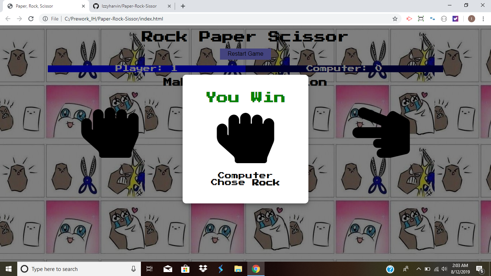
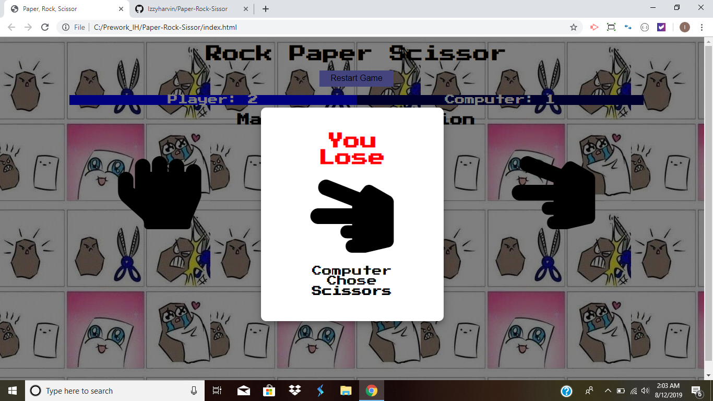
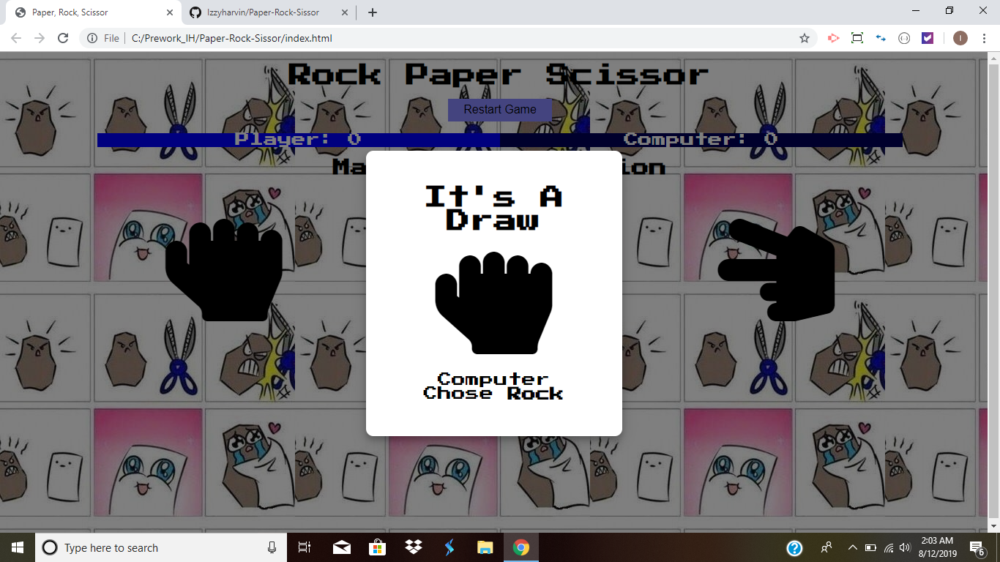

# Paper-Rock-Sissor
This is the basic game called Paper, Rock, Scissor.

#Objective
You playing against the computer; Paper beats rock, rock beats scissors, scissors beat paper.

#Created languages:
*HTML
*CSS
*JavaScript

#Files used:
*index.html
*style.css
*module.css
*logic.js

#How to play the game
Step 1: Open link https://izzyharvin.github.io/Paper-Rock-Sissor/ 

Step 2: Start playing the game and choose from paper, rock, scissors.
Step 3: You either Win, Lose, or Draw 
 
 
 